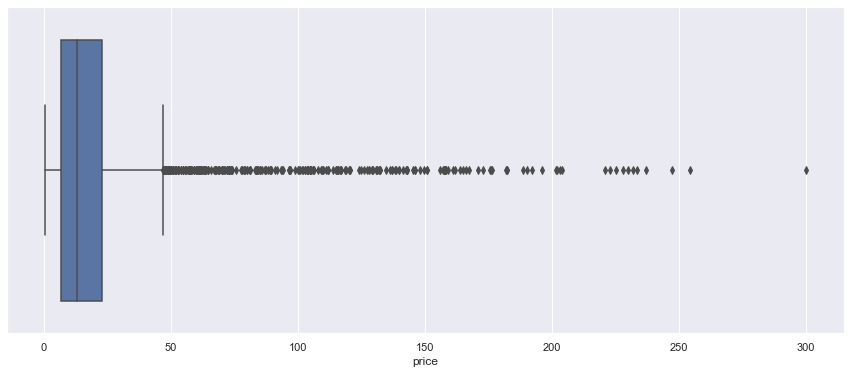

# Brief 7 - Book Business

## Partie 2

### Mission 1
Le projet contenait 3 bases de données : ventes, clients et produits. Après les avoir liées, un nettoyage s'imposait.
J'ai commencé par supprimer les doublons:
```
df_main.drop_duplicates()
```
Ensuite enlever les lignes contenant des cellules vides. Ici j'ai envelé toutes les lignes dont la colonnes "price" est vide:
```
df_main = df_main[df_main['price'].notna()].reset_index()
```
Et enfin, je filtre les prix en supprimer ceux qui sont inférieurs et égals à 0:
```
df_main = df_main[df_main['price'] >= 0]
```
Le tri terminé, il va me rester 336713 entriés.

### Mision 2

#### A. Indicateurs de tendance centrale et de dispersion

Je vais utiliser que la BDD produits pour ces exercices. 
```
df_produits.describe()

--- output ---
             price        categ
count  3286.000000  3286.000000
mean     21.863597     0.370359
std      29.849786     0.615446
min       0.620000     0.000000
25%       6.990000     0.000000
50%      13.075000     0.000000
75%      22.990000     1.000000
max     300.000000     2.000000
```
J'obtiens alors, la moyenne, l'écart-type, le min et le max.
Boîte à moustache pour les prix de chaque articles


#### B. analyse de concentration, via une courbe de Lorenz et un indice de Gini
